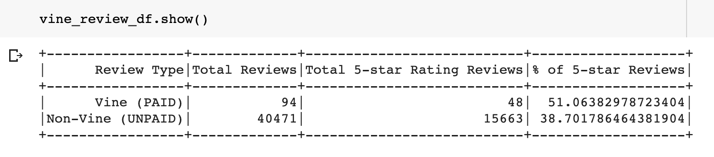

# Amazon_Vine_Analysis

## PURPOSE
The purpose of this challenge is to complete an analysis on video game reviews for Amazon to help determine if there is any bias between paid Vine reviews and non-paid reviews by determining the 5-star voting percentage for each.

## RESULTS
- To begin, we ensured that the data is filtered by items that had more than 20 reviews, with greater than 50% of those being helpful reviews.
- There were a total of 94 Vine paid reviews,  and 40,471 unpaid reviews.
- Out of the 94 Vine reviews, 48 were 5 star reviews; and out of the 40,471 non-vine reviews, 15663 were 5 star reviews.
- The paid vine 5-star review percentage was approximately 51%, while the unpaid 5-star review percentage was approximately 39%.

## SUMMARY
As determined in the results, it appears that the sample sizes vary significantly, with fewer than 100 vine reviews compared to more than 40,000 non-vine reviews. Using the 5-star reviews as a benchmark to determine bias, it seems like there is a 12% difference in 5 star review percentages, where those 12% were more likely to give a 5-star review when paid compared to the unpaid reviews. The table below presents that summary.

